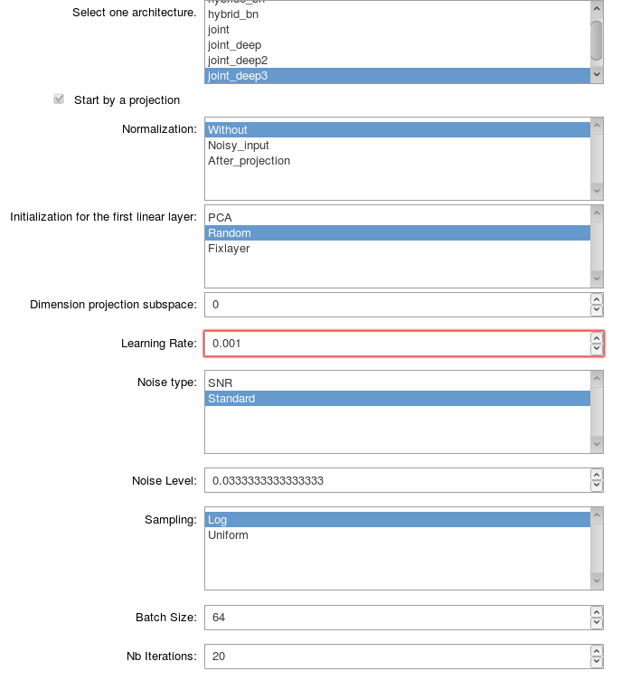

# Saving a settings file

> In order to launch a training, you need to save a setting file using the interactive tools contained in the folder ``notebooks`` (`offline_settings_training.ipynb` and `online_settings_training.ipynb`). In this page, I want to present you the different parameters that you will be asked to define. This description will also allow to you to completely understand how large is the model implemented (i.e. what you can do using directly this project and what you can't).

The following screen shot presents an example of the interactive tool to define the settings for a training.

## General parameters for training

- `name_model`  
**String**   
Name of the architecture of the network. The name is chosen among the architecture defined in the package [MRF.models](https://mrf.readthedocs.io/en/latest/autodocs/MRF.models.html).    

If the chosen model starts by a projection :

> - `normalization`  
**String**   
Type of normalization of the data. The possible types of normalization that can be used are defined in the class `Normalization` of the module [Training_parameters](https://mrf.readthedocs.io/en/latest/autodocs/MRF.html#module-MRF.Training_parameters). 

>- `initilization`  
**String**  
Type of initilization for the weights of the first linear layer which should perform the projection. The possible types of initialization that can be used are defined in the class `Initialization` of the module [Training_parameters](https://mrf.readthedocs.io/en/latest/autodocs/MRF.html#module-MRF.Training_parameters). 

> - `dimension_projection`   
**Int**   
Dimension of the subspace on which the projection will be performed.

>- `namepca`  
**str**   
Name of the file containing the basis functions obtained with an online PCA algorithm in order to initalize or define the first linear layer supposed to perform the projection. This file needs to be a `.mat` file with the basis functions saved with the key word `basis`. 
The basis functions need to be saved with the size ``(number of functions) x (length fingerprint)``.    

- `optimizer`  
**String**   
Name of the optimizer used for the training. The possible names to use are defined in the class `Optimizer` of the module [Training_parameters](https://mrf.readthedocs.io/en/latest/autodocs/MRF.html#module-MRF.Training_parameters).    
Number of epochs.    

- `lr`  
**Float**   
Learning rate.    

- `noise_type`  
**String**   
Type of noise that you want to use. The different types of noise are defined in the module [Training_parameters](https://mrf.readthedocs.io/en/latest/autodocs/MRF.html#module-MRF.Training_parameters).    

- `noise_level`  
**Float**   
Level of noise that you want to use.    
 

- `batch_size`  
**Int**   
Batch size.    

- `nb_iterations`  
**Int**   
Number of iterations.    

- `nb_epochs`  
**Int**   
Number of epochs.    

- `loss`  
**Array of String**   
Type of loss used. The array has a length 5 corresponding to the 5 parameters (`m_{0s}`, `T_{1f}`, `T_{2f}`, `R` and `T_{2s}`). The i-th element of this array gives the type of transformation applied to the parameter i. 
The different type of losses are defined in the class Loss in the module [Training_parameters](https://mrf.readthedocs.io/en/latest/autodocs/MRF.html#module-MRF.Training_parameters).    

- `params`  
**Array of Int**   
Define the parameters that you want to estimate. Number 0 corresponds to m0s, number 1 to `T_{1f}`, etc. (The details are defined in the the module [Training_parameters](https://mrf.readthedocs.io/en/latest/autodocs/MRF.html#module-MRF.Training_parameters) with the vectors `nametoparam` and `paramtoname`).    

- `minpd`  
**Float**   
Minimum proton density.    

- `maxpd`  
**Float**   
Maximum proton density.    

- `save_name`  
**String**   
Name given to your training.    

- `validation`  
**Bool**   
Boolean which is True if you want to track validation loss and errors during the training.    

If `validation` is True :

> - `validation_size`  
**Int**   
Number of fingerprints used for the validation dataset.

------

## Parameters specific to the **Offline** setting

- `nb_files`  
**String**   
Number of files used for training and validation. I recall that your files needs to be saved in a folder with a name that you can choose and that should be located in *MRF/Offline/loading_data*.    

- `path_files`  
**String**   
Name that you gave to the folder located in *MRF/Offline/loading_data* which contains the files. Two different type of files should be saved in this folder:

-- the files *fingerprints1.npy*, *fingerprints2.npy*, ... Each file contains an array of size n x (length fingerprint) where n is an integer that should be greater than the batch size chosen. **Each fingerprint should be computed considering that the proton density is equal to 1**.    

-- the files *params1.npy*, *params2.npy*, ... Each file contains an array of size ``n x (length fingerprint)`` and gives the parameters used to compute the fingerprints saved in the files *fingerprints1.npy*, *fingerprints2.npy*, ...

-- **If your loss requires the knowledge of the Cramer Rao Bound**, you also need to save n this folder the files *CRBs1.npy*, *CRBs2.npy*, ... Each file contains an array of size ``n x 6`` and gives the Cramer Rao Bounds for the parameters `m_{0s}`, `T_1`, `T_{2f}`, `R`, `T_{2s}` and `PD` **in this order**.

If `validation` is True :

> - `small_validation_size`  
**Int**   
Number of fingerprints used for the smaller validation dataset.

------

## Parameters specific to the **Online** setting

- `save_samples`  
**Bool**   
Boolean which when set to True will allow to save the sampled points during the training.    

- `sampling`  
**String**   
Name of the sampling strategy hat you want to use. The different possible sampling name are defined in the class `Sampling` of the module [Training_parameters](https://mrf.readthedocs.io/en/latest/autodocs/MRF.html#module-MRF.Training_parameters). Each name is associated with a particular sampling strategy defined in the method *sample* of the class **Data_class**.    

- `min_values`  
**Array of float**   
Five dimensional vector containing the minimum values that you want to consider when the parameters space will be sampled. The components of the vector corresponds to the parameters `m_{0s}`, `T_1`, `T_{2f}`, `R` and `T_{2s}` in this order.    

- `max_values`  
**Array of float**   
Five dimensional vector containing the maximum values that you want to consider when the parameters space will be sampled. The components of the vector corresponds to the parameters `m_{0s}`, `T_1`, `T_{2f}`, `R` and `T_{2s}` in this order.    

- `t2_wrt_t1`  
**String**   
Define the way you want to sample the parameter `T_{2f}` with respect to `T_1`. The different ways to use this option are defined in the class `T2wrtT1` of the module [Training_parameters](https://mrf.readthedocs.io/en/latest/autodocs/MRF.html#module-MRF.Training_parameters).    

