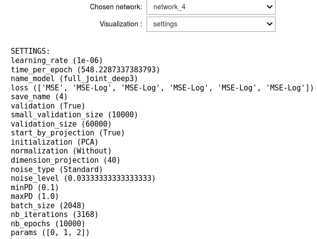
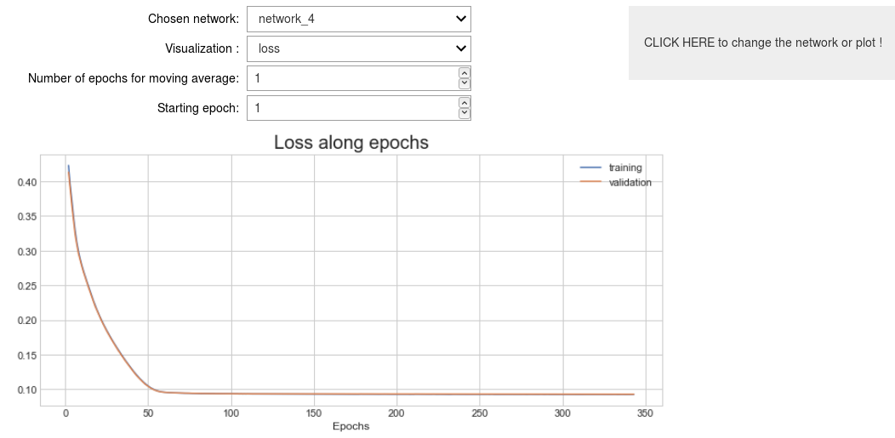
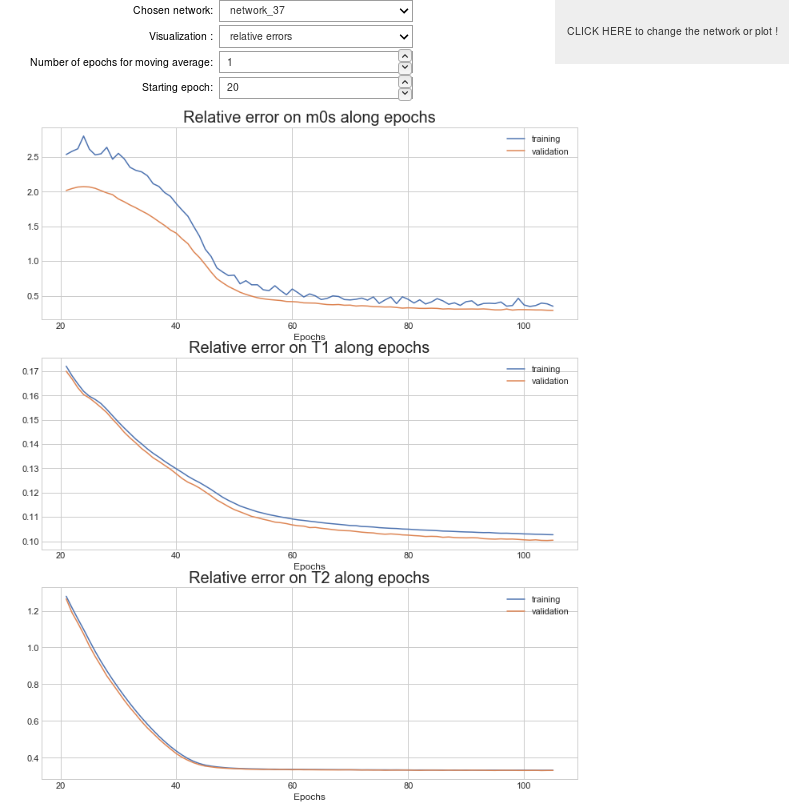
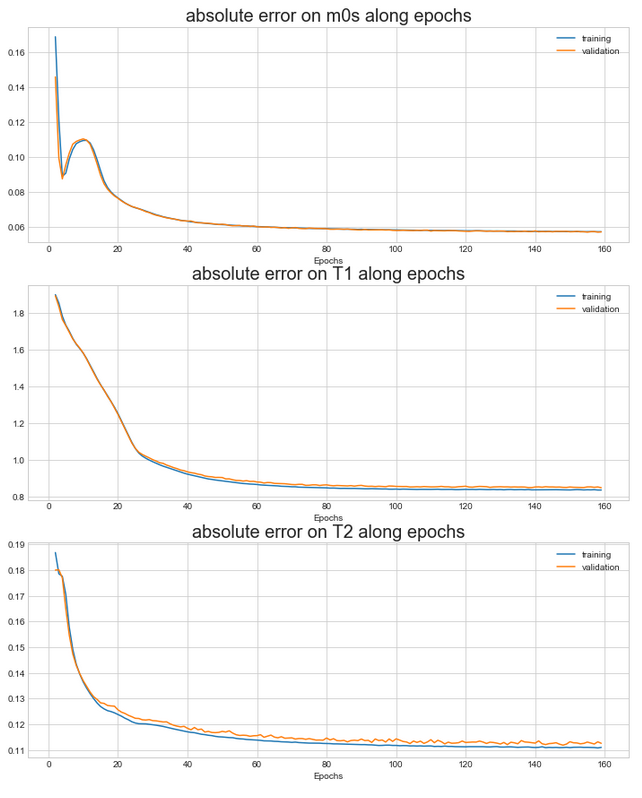
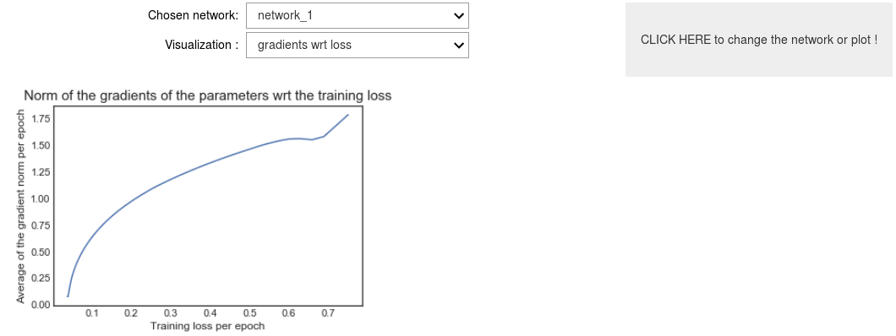
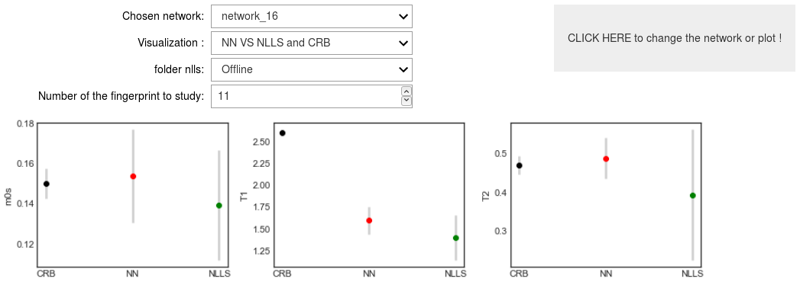
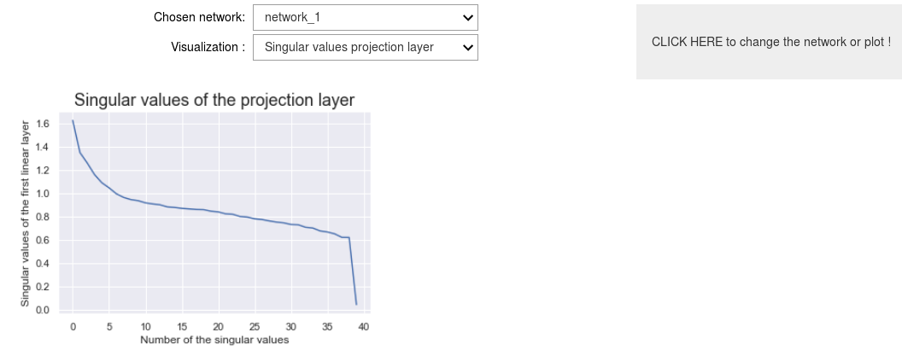
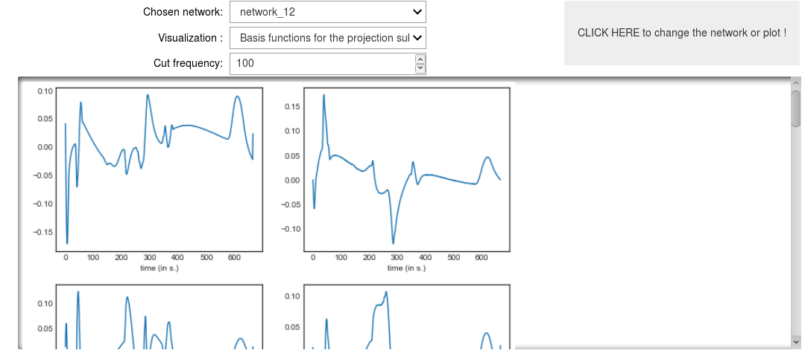

# Visualize the results


> We explain here the way you can easily study the results of your experiments.

## Requirements
In the root directory of the project, you need to have:
- a folder named *settings_files_offline* containing the settings files used for the trainings  .
- a folder named *save_networks_offline* containing the torch dictionary automatically saved during the training.

> Note that these folders will be automatically generated if you follow the usual way to launch the code as explained [here](https://mrf.readthedocs.io/en/latest/runcode.html).


## Visualization of the results

Launch the notebook *offline_visualize_resuts.ipynb* located in the folder **notebooks** with Jupyter. Running the cells, you will find an interactive tool allowing you to choose the network you want to study and the information you want to visualize.


In the following, I list the visualizations that you can choose using this interactive tool. Some conditions can be asked to have access to some visualizations. In such cases, those conditions will be precised in a paragraph entitled **Requirements**.

### Settings

Choosing this option, you will be able to see the details of the settings chosen for the training considered.




### Loss

This option plots the evolution of the loss function along the epochs. 

If the parameter `validation` of the settings is `True`, you will see both the training and the validation loss. Otherwise, only the training loss will be visible.



### Relative Errors

Selecting the option Relative errors, figures presenting the evolution of the relative errors on the different parameters estimated along the epochs will be plotted.  

If the parameter `validation` of the settings is `True`, you will see both the training and the validation relative errors. Otherwise, only the training relative errors will be visible.




### Absolute Errors

Selecting the option Absolute errors, figures presenting the evolution of the absolute errors on the different parameters estimated along the epochs will be plotted.  

If the parameter `validation` of the settings is `True`, you will see both the training and the validation absolute errors. Otherwise, only the training absolute errors will be visible.




### Absolute Errors Over CRBs

Selecting the option Absolute errors over CRBs, figures presenting the evolution of the absolute errors divided by the square root of the CRBs on the different parameters estimated along the epochs will be plotted.  

If the parameter `validation` of the settings is `True`, you will see both the training and the validation absolute errors over the CRBs. Otherwise, only the training curves will be visible.


### Gradients wrt loss

This option will plot the evolution of the average (on each epoch) of the norm of the gradients of the parameters of the network with respect to the training loss. This objective of this figure is to ensure you that your training behaves correctly. You should see that the average of the norm of the gradients is converging towards zero with the loss deacreasing.



### Error

**Requirement**: This option is visible only if the parameter `validation` of the settings is `True`.


### NN VS NLLS and CRB (Neural Network VS Non Linear Least Squares and Cramer Rao Bound)

This option allows you to see for a specific set of fingerprints that you have defined by hand the mean and the standard estimator of the parameters using the neural network or the non linear least squares. The Cramer Rao Bounds of the different parameters for the fingerprint studied is also computed and can be compared with the standard deviations obtained using the neural network and the NLLS. 

**Requirement**: In order to be able to use this option, you need to have previously launched the script `compute_nlls.py` located in the root directory. The purpose of this script is to compute the estimations of the parameters `m_{0s}`, `T_1`, `T_{2f}`, `R` and `T_{2s}` and `PD` (the proton density) given by the non linear least squares for different noise realizations and for fingerprints that you can define by yourself. The following explains you the steps to follow in practice.

- 0) Choose the name that you want to give to this computations (e.g. a natural name would be the name of the sampling strategy for which you have decided to define the parameters in the step 1)).

- 1) Define the parameters that you want to estimate using the NLLS. Here I present you who to modify the script `compute_nlls.py`. Let say you want to study the results for only two fingerprints, the first with the parameters `m_{0s}=0.1`, `T_1=1`, `T_2=0.1`, `R=10`, `T_{2s}=1e-3` and `PD=0.4` and the second one with the parameters `m_{0s}=0.5`, `T_1=0.5`, `T_2=0.01`, `R=100`, `T_{2s}=1e-1` and `PD=1` and ou choose the name 'Log' in step 0) (associated to the `Log` sampling strategy for example). Then the script `compute_nlls.py` should have the following form:

```python

from MRF.BaseData_class import *
from MRF.Training_parameters import *
from MRF.simulate_signal import simulation
import argparse
import os
import numpy as np

if __name__ == '__main__':
	
	parser = argparse.ArgumentParser(description='Description of the training parameters.')
	parser.add_argument('--nbnoises', type=int, default=100)
	parser.add_argument('--forloop', type=str)
	parser.add_argument('--save_name', type=str)
	args = parser.parse_args()
	
	########### DEFINE THE PARAMETERS THAT YOU WANT TO ESTIMATE WITH THE PROTON DENSITIES ASSOCIATED
	
	
	## EXAMPLE ASSOCIATED WITH THE SAMPLING STRATEGY "Uniform"	
	if args.save_name == "Uniform":

		##### ALREADY DEFINED IN THE SCRIPT 
		..................................


	elif args.save_name == "Log":
		# Define the parameters m0s, T1, T2, R, T2s
		parameters_nlls = np.array([[0.1, 1, 0.1, 10, 1e-3],
								[0.5, 0.5, 0.01, 100, 1e-1]])
								 
		# Define the proton densities
		proton_density = [0.4, 1]
		
		# Define the min and max values for the five parameters m0s, T1f, T2f, R, T2s and the proton density
		bounds = ([0,0.1,0.001,5,1e-3,0.001],[0.75,3.5,3,500,0.2,1.1])

	
	################################################################################################

	# REST OF THE CODE FOR THE SCRIPT THAT DOESN'T NEED TO BE MODIFIED
	..................................
```  

- 2) You can now launch the script ! To do so, you have two options.

-- If you can launch an **array job**, this will allow you to have one job for each fingerprint studied and thus to have faster computations. The argument `forloop` of the script needs to be set to **"False"**.

In our example using the name **"Log"** and with **2** fingerprints, the batch command would be the following:

```bash
srun -t20:00:00 --array=0-1 python compute_nlls.py --forloop "False" --save_name "Log"
```

**Remark:** If we use 10 fingerprints (and not 2), we have to write *--array=0-9*.

-- Otherwise, a for loop will be used to compute the estimations given by the nnls for the different noise realizations and the different fingerprints.

In our example using the name "Log", the batch command would be the following:

```bash
srun -t20:00:00 python compute_nlls.py --forloop "True" --save_name "Log"
```





### First layer


**Requirement**: This option is visible only if the network starts with a projection layer.


Plots the weights of the first layer supposed to perform the projection of the fingerprint onto a lower dimensional subspace.


### Singular values projection layer


**Requirement**: This option is visible only if the network starts with a projection layer.


Plots the decay of the singular values of the of the matrix given by the weights of the first linear layer.




### Basis functions for the projection subspace

**Requirement**: This option is visible only if the network starts with a projection layer.


Plots the basis functions associated with the first linear layer. More precisely, a SVD of the matrix given by the weights of the first linear layer is performed and the basis functions plotted is obtained considering the right singular vectors. You can also low pass filter the basis functions if desired by providing a cut frequency.



